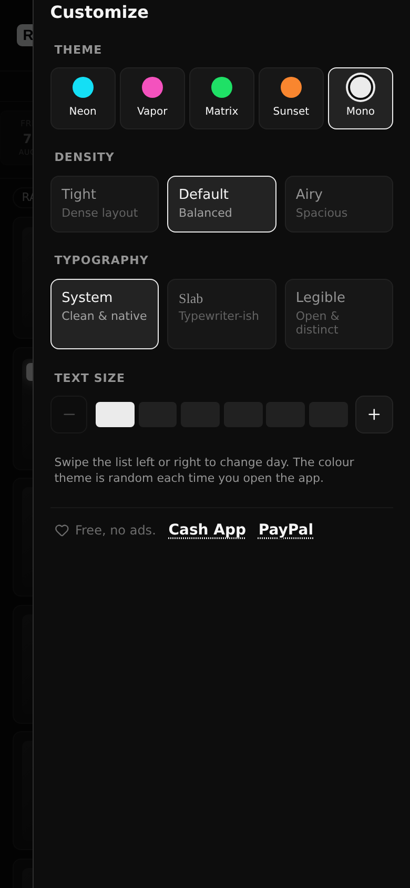
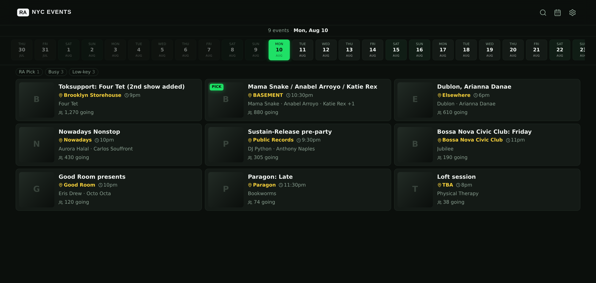

<p align="center">
  
</p>

<p align="center">
  A fast, mobile-first listing of <b>Resident Advisor</b>'s New York events. Pick
  a day, scan the lineups, tap a DJ to hear them, tap through to RA for tickets.
</p>

<p align="center">
  <b>Live: <a href="https://ra-nyc.vercel.app">ra-nyc.vercel.app</a></b>
</p>

---
<p align="center">
  <sub>The night's listings · search by DJ, party, promoter or venue · a set
  playing in the docked transport</sub>
</p>

---

## What it does

Every screen is built around one question — *what's on tonight, and is it worth
going?* — so the whole app is a single scrolling list with no login, no signup
and no navigation to learn.

**Listings.** One day at a time, sorted busiest first with RA Picks flagged.
Drag the date rail to move between nights, or jump to any date with the
calendar. Tap an event for the full flyer, blurb and lineup.

Three chips narrow the night without another request: **Low-key** (the night's
quietest third by head count), **Busy** (the top third) and **RA Pick**. The tiers
are relative to that night, because a Tuesday's biggest room draws fewer people
than a Saturday's quietest.

The day rolls over at **3:30am**, not midnight. RA files an event under the date
it starts, so at 1am a midnight boundary would throw away the night you are
still out on.

**Preview a night.** One tap on a party queues one set from each DJ on the bill
and starts playing — it begins on whichever DJ resolves first rather than waiting
for the whole lineup, and the rest arrive behind the music. Enough to tell what a
room sounds like without committing to anyone's hour. If you keep listening for a
minute, a small link to tickets on RA appears in the transport; before that there
is nothing to ignore.

**DJ sets.** Tap any name in a lineup and it resolves that artist to their
SoundCloud and Mixcloud catalogue, newest first, plus a bio and up to five
profile links. It starts playing on the tap — opening a DJ is the request to
hear them. Sets play in a transport bar docked at the bottom — play/pause,
next/previous, scrubbable timeline — and **keep playing while you browse**, so
finding out what someone sounds like doesn't cost you your place in the listings.
The set also reaches the lock screen with its real title and cover art, rather
than announcing itself as a SoundCloud widget.

Two DJs can share a name exactly, and then no amount of string matching can
separate them. So resolution reads the artist's RA biography: a SoundCloud link
written there settles it outright, and failing that the places, labels and
residencies it mentions decide which of several same-named accounts to trust.
When nothing corroborates, an empty set list is the answer — a confidently wrong
one is worse.

**Looks.** Four themes (Vapor, Neon, Matrix, Sunset — listed lightest to
darkest), three typefaces, three densities and six text sizes. Typeface and text
size are sliders; theme and density are rows. Card, border and
muted-text lightness are identical across every theme, so the only things that
change are hue and how dark the background goes. Spacing tracks type size at partial strength,
so the ratio of ink to air stays roughly constant across every combination rather
than only looking right at the defaults. Venue names carry their own hue per
theme, so where a night is reads apart from when it is. The theme is picked at
random each time you open it, never the same one twice running. Preferences
persist locally; there is no account and nothing is sent anywhere.

<p align="center">
  
</p>

**On a laptop.** The listings become two columns, then three, against a capped
measure — wide enough to use the window, narrow enough that a list still reads as
a list. Base type steps up with the viewport, on top of whatever text size you
picked. Installed, it runs without an address bar or tab strip on every platform
that supports it.

<p align="center">
  
</p>

**Search.** The magnifier next to the calendar searches NYC listings by DJ,
party, promoter or venue — six weeks ahead and four months back, upcoming first,
then past. Matching is accent- and leet-insensitive and tolerates a typo, so
`bjork` finds Björk and `holo` finds h0l0, and a typo lands in either word of a
two-word name. Vibe words widen too — `after` reaches afterhours and sunrise
sets, `queer` reaches the parties whose name is the signal — because RA exposes
no genre field and a vocabulary is the only honest way to bridge that. Picking a
result jumps the listings to that night and opens it.

RA caps a page at 100 listings and New York produces about that many a day, so
searching live reaches roughly three days no matter how it is paged. Instead,
every listing the app fetches is remembered, and search reads that index — it
fills as the app is used, and a nightly job tops up whatever nobody browsed.
Live listings still cover the newest days, and the response says how much of the
window it actually had.

**Sounds like.** Only SoundCloud tracks of 45 minutes or more count as sets;
below that it's a single, not a night.

**Where it is.** Tapping a venue name opens a coloured street map — tiles
composed in the page rather than a mapping library, so it costs nothing until you
open one — with the address and one-tap hand-offs to your map app, Uber and
Lyft. Venue names carry their own colour per theme so they're easy to scan for.

**Speed.** The query cache is persisted to disk, so returning to the app paints
your last day before the network answers. Adjacent days are prefetched, and every
API response is shared across visitors by Vercel's edge cache.

**When things break.** If `ra.co` is unreachable the listings come from the saved
index instead, labelled *Saved listings* rather than passed off as current. And
with no network at all the app still opens and still shows the days you looked at
— which is the point, given most of the walk to a venue is underground.

---

## Stack

| Layer     | Choice |
| --------- | ------ |
| UI        | React 19 + TypeScript, Tailwind CSS 3 |
| Data      | TanStack Query, persisted to `localStorage` |
| Build     | Vite 7 |
| API       | Vercel serverless functions (`api/`) |
| Hosting   | Vercel |
| Analytics | Vercel Analytics (no cookies, no consent banner) |
| Database  | Optional Neon — artist links and the search index; degrades to live lookups without it |
| Tests     | Vitest for pure functions; Playwright (`playwright-core`) for behaviour |

Sets come from SoundCloud, Mixcloud and the Internet Archive, each behind a
common player interface. Only SoundCloud needs credentials; the other two are
keyless.

---

## How it works

```
Browser  ──GET /api/events?date=YYYY-MM-DD──▶  Vercel function
                                                     │
                                                     ├─ POST https://ra.co/graphql
                                                     │  (browser-like headers)
                                                     │
                                              ◀──────┘ JSON, cached at the edge
```

The browser never calls `ra.co` directly, for three reasons:

- **CORS** — `ra.co/graphql` sends no `Access-Control-Allow-Origin`, so a direct
  browser call is blocked.
- **Forbidden headers** — `User-Agent`, `Referer` and `Origin` cannot be set from
  browser `fetch()`; browsers drop them silently. RA rejects requests that don't
  look like a browser, so those have to be set server-side.
- **Caching** — one function response is shared by every visitor at the edge,
  instead of every visitor hitting RA.

---

## The mark


`RA` in a white block, Helvetica bold — the same mark on the tab, the home-screen
icon and the header, so they read as one thing rather than three. It is the only
element in the app that ignores every preference: the typeface, size and colour
are all fixed in CSS rather than inherited, because a wordmark that renders in a
different face depending on your settings is not a wordmark. Four end-to-end
assertions hold it there, one per preference axis.

<br clear="left">

Source: [`public/ra-favicon.svg`](public/ra-favicon.svg) and
[`public/ra-maskable.svg`](public/ra-maskable.svg) (Android crops home-screen
icons, so the maskable variant keeps the block inside the middle 80%).

---

## A note on Resident Advisor

This is an unofficial client for RA's public GraphQL API, and it links back to
`ra.co` for every event. It's polite by design: results are cached at the edge,
so RA sees roughly one request per day-view per five minutes rather than one per
visitor. If RA publishes formal API terms or asks that this stop, honour that.

-
